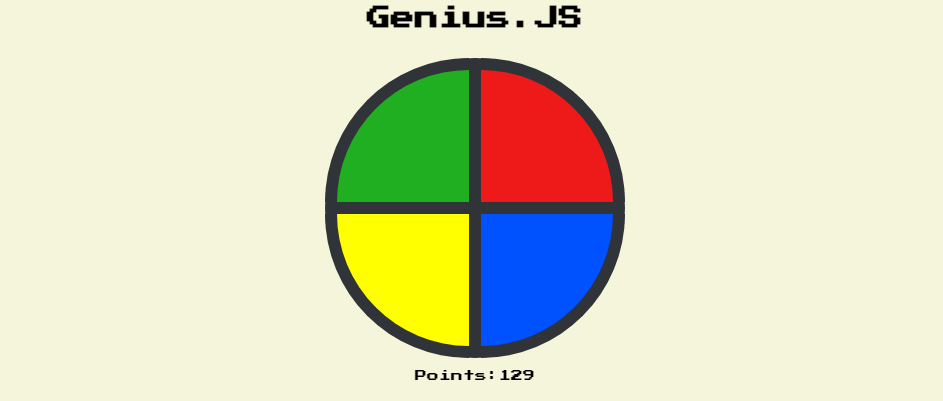

# Genius JS

You can test this app at 

## About

A small game that refers to the childhood toy called Genius.

## How to play

The game consists of memorizing and reproducing the colors that flash on the disc in the same order. 

Use your mouse to click on the colors of the disc in the same order as they were shown. Every time you get it right you score, if you get it wrong, game-over.

## Goals

This project was created with the aim of practicing arrow functions.

As the name suggests, it was written in JavaScript

Enjoy!